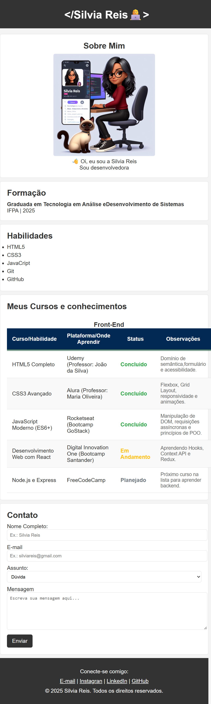

# Portfólio - Curso *Comece na Programação* (v2)

Este projeto é a **segunda versão** do portfólio desenvolvido durante o curso **"Comece na Programação"**, ministrado pelo professor **Buniek Lacerda**. O objetivo principal é aplicar os conceitos aprendidos nas aulas de forma prática, criando um site pessoal com melhorias em relação à versão anterior.

## 📚 Curso

- **Nome:** Comece na Programação  
- **Professor:** Buniek Lacerda

## 🛠️ Sobre esta versão (v2)

Esta nova versão traz melhorias no layout, na organização do código e na apresentação dos conteúdos. É uma continuação direta da versão original e demonstra a evolução no aprendizado de HTML, CSS e outras tecnologias abordadas durante o curso.

## 🔗 Primeira versão do projeto

Você pode acessar a primeira versão do portfólio pelo link abaixo:

[🔗 Primeira versão do portfólio - GitHub](https://github.com/Silviareis1/minha-pagina)

## 🚀 Tecnologias Utilizadas

- HTML5  
- CSS3  

## ✍️ Autora

Desenvolvido por **Silvia Reis**, aluna do curso *Comece na Programação*.

